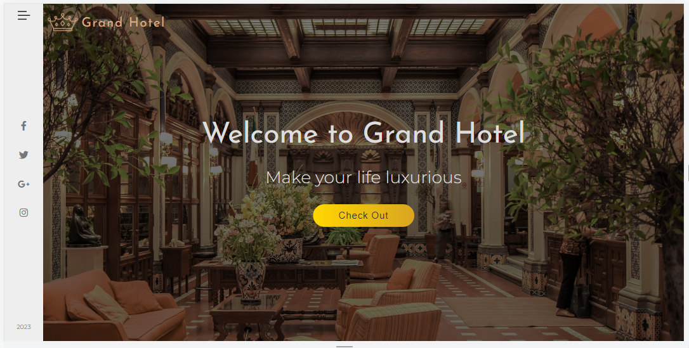

# Grand Hotel Theme Website

Welcome to the Grand Hotel Theme Website, a beautiful and elegant website built using only HTML and CSS. This website showcases various sections to provide users with a seamless experience in exploring the hotel's offerings. Whether you're interested in learning about the hotel, its rooms, satisfied customers, or want to get in touch, this website has it all!

## Table of Contents

1. [Navigation](#navigation)
2. [Sidebar](#sidebar)
3. [About Us](#about-us)
4. [Rooms](#rooms)
5. [Customers](#customers)
6. [Footer](#footer)

## Navigation

The navigation bar is placed at the top of every page, providing easy access to all the essential sections of the website. It allows users to smoothly navigate between different pages of the site, ensuring a user-friendly experience.

## Sidebar

The sidebar is a convenient feature that appears on certain pages of the website. It presents additional navigation options and essential information, enhancing the user's ability to explore the website's content.

## About Us

In the About Us section, you can find a detailed overview of the Grand Hotel. Learn about the hotel's history, vision, mission, and the team behind its success. Get an insight into the hotel's philosophy and commitment to customer satisfaction.

## Rooms

Discover our luxurious and elegant rooms in this section. Each room is meticulously designed to provide the utmost comfort and relaxation to our guests. High-quality images and descriptions showcase the amenities and features of each room, helping visitors make informed choices.

## Customers

Happy customers are the heart of our hotel, and in this section, we proudly share their testimonials and feedback. Read about the wonderful experiences of our guests, their kind words, and how the Grand Hotel exceeded their expectations.

## Footer

The footer is a comprehensive section that includes various elements to assist users and provide them with additional resources:

## Contributing

We welcome contributions to improve the Grand Hotel Theme Website. If you find any bugs, have suggestions for new features, or want to enhance the design, feel free to open an issue or submit a pull request. Let's work together to create an exceptional experience for our website visitors.

## Acknowledgments

We want to express our gratitude to the developers and designers who contributed to this project. Your dedication and creativity have made the Grand Hotel Theme Website possible.

---

Thank you for visiting the Grand Hotel Theme Website! We hope you enjoy exploring our site and find it informative and visually appealing. If you have any questions or need further assistance, please don't hesitate to contact us. Happy browsing!